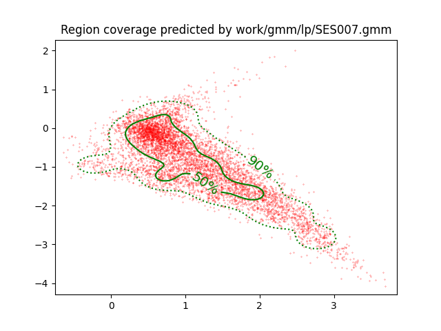
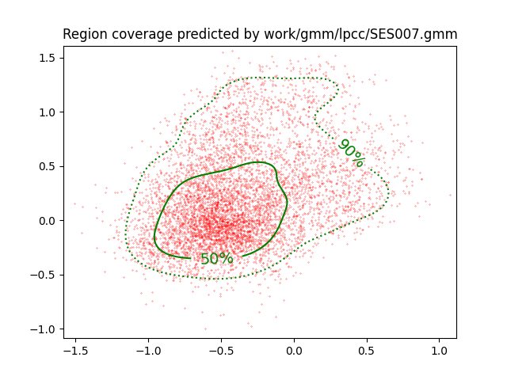
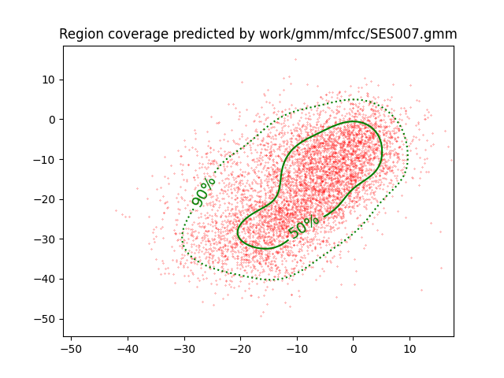

PAV - P4: reconocimiento y verificación del locutor
===================================================

Obtenga su copia del repositorio de la práctica accediendo a [Práctica 4](https://github.com/albino-pav/P4)
y pulsando sobre el botón `Fork` situado en la esquina superior derecha. A continuación, siga las
instrucciones de la [Práctica 2](https://github.com/albino-pav/P2) para crear una rama con el apellido de
los integrantes del grupo de prácticas, dar de alta al resto de integrantes como colaboradores del proyecto
y crear la copias locales del repositorio.

También debe descomprimir, en el directorio `PAV/P4`, el fichero [db_8mu.tgz](https://atenea.upc.edu/mod/resource/view.php?id=3654387?forcedownload=1)
con la base de datos oral que se utilizará en la parte experimental de la práctica.

Como entrega deberá realizar un *pull request* con el contenido de su copia del repositorio. Recuerde
que los ficheros entregados deberán estar en condiciones de ser ejecutados con sólo ejecutar:

~~~~~~~~~~~~~~~~~~~~~~~~~~~~~~~~~~~~~~~~~~~~~~~~~~~~~.sh
  make release
  run_spkid mfcc train test classerr verify verifyerr
~~~~~~~~~~~~~~~~~~~~~~~~~~~~~~~~~~~~~~~~~~~~~~~~~~~~~

Recuerde que, además de los trabajos indicados en esta parte básica, también deberá realizar un proyecto
de ampliación, del cual deberá subir una memoria explicativa a Atenea y los ficheros correspondientes al
repositorio de la práctica.

A modo de memoria de la parte básica, complete, en este mismo documento y usando el formato *markdown*, los
ejercicios indicados.

## Ejercicios.

### SPTK, Sox y los scripts de extracción de características.

- Analice el script `wav2lp.sh` y explique la misión de los distintos comandos involucrados en el *pipeline*
  principal (`sox`, `$X2X`, `$FRAME`, `$WINDOW` y `$LPC`). Explique el significado de cada una de las 
  opciones empleadas y de sus valores.

---

# Análisis del Script `wav2lp.sh`

Este script se utiliza para la extracción de características LPC (Linear Predictive Coding) de un archivo de audio `.wav`. A continuación, se detallan los comandos involucrados en el pipeline principal y el significado de cada una de las opciones empleadas.

## Comprobaciones Iniciales y Preparación del Entorno

1. **Configuración de `pipefail`**:
   ```bash
   set -o pipefail
   ```
   Asegura que el script devolverá el código de error del último comando que falle en el pipeline.

2. **Creación y Limpieza de Archivos Temporales**:
   ```bash
   base=/tmp/$(basename $0).$$ 
   trap cleanup EXIT
   cleanup() {
      \rm -f $base.*
   }
   ```
   Define un nombre base para los archivos temporales y asegura su eliminación al finalizar el script.

3. **Validación de Argumentos**:
   ```bash
   if [[ $# != 3 ]]; then
      echo "$0 lpc_order input.wav output.lp"
      exit 1
   fi
   ```
   Verifica que se han pasado tres argumentos: el orden LPC, el archivo de entrada y el archivo de salida.

## Configuración de Comandos Según el Entorno

4. **Definición de Comandos**:
   ```bash
   if [[ $UBUNTU_SPTK == 1 ]]; then
      X2X="sptk x2x"
      FRAME="sptk frame"
      WINDOW="sptk window"
      LPC="sptk lpc"
   else
      X2X="x2x"
      FRAME="frame"
      WINDOW="window"
      LPC="lpc"
   fi
   ```
      **Nota**: Dado que trabajamos en diferentes sistemas operativos, tuvimos que ajustar el valor de `UBUNTU_SPTK` en nuestros entornos. Maria, que usa Ubuntu, establece `UBUNTU_SPTK=1`, mientras que Pol, usando macOS, lo configuro como `UBUNTU_SPTK=0`.

## Procesamiento Principal de Extracción de Características

5. **Pipeline Principal de Procesamiento**:
   ```bash
   sox $inputfile -t raw -e signed -b 16 - | $X2X +sf | $FRAME -l 240 -p 80 | $WINDOW -l 240 -L 240 | $LPC -l 240 -m $lpc_order > $base.lp || exit 1
   ```

### Análisis de Cada Comando y Sus Opciones

- **`sox`**:
   ```bash
   sox $inputfile -t raw -e signed -b 16 -
   ```
   Convierte el archivo de audio `.wav` a datos crudos (raw), con formato de datos firmado (`-e signed`) y 16 bits por muestra (`-b 16`).

- **`$X2X`**:
   ```bash
   $X2X +sf
   ```
   Convierte los datos de audio de formato binario (`s` para short) a formato de coma flotante (`f`).

- **`$FRAME`**:
   ```bash
   $FRAME -l 240 -p 80
   ```
   Divide los datos en tramas de longitud 240 muestras (`-l 240`), con un desplazamiento de 80 muestras entre tramas (`-p 80`).

- **`$WINDOW`**:
   ```bash
   $WINDOW -l 240 -L 240
   ```
   Aplica una ventana a cada trama de longitud 240 (`-l 240`) y longitud de ventana efectiva 240 (`-L 240`).

- **`$LPC`**:
   ```bash
   $LPC -l 240 -m $lpc_order
   ```
   Calcula los coeficientes LPC usando el método de Levinson-Durbin. La longitud de la señal de entrada es 240 (`-l 240`) y el orden del LPC es especificado por el usuario (`-m $lpc_order`).

## Finalización del Procesamiento y Generación del Archivo de Salida

6. **Cálculo de Dimensiones de la Matriz LPC**:
   ```bash
   ncol=$((lpc_order+1))
   nrow=`$X2X +fa < $base.lp | wc -l | perl -ne 'print $_/'$ncol', "\n";'`
   ```

7. **Construcción del Archivo de Salida**:
   ```bash
   echo $nrow $ncol | $X2X +aI > $outputfile
   cat $base.lp >> $outputfile
   ```
   Se genera el archivo de salida con las dimensiones de la matriz seguidas de los coeficientes LPC calculados.

El script `wav2lp.sh` implementa un pipeline que convierte un archivo de audio `.wav` en una representación LPC. Utiliza `sox` para convertir el audio a datos crudos, `x2x` para la conversión de formatos de datos, `frame` para segmentar la señal en tramas, `window` para aplicar una ventana a cada trama, y `lpc` para calcular los coeficientes LPC. Cada comando y sus opciones son críticos para el procesamiento correcto de la señal de audio y la extracción de las características deseadas.

---


- Explique el procedimiento seguido para obtener un fichero de formato *fmatrix* a partir de los ficheros de
  salida de SPTK (líneas 45 a 51 del script `wav2lp.sh`).
  
  El procedimiento seguido para obtener un archivo de formato *fmatrix* a partir de los archivos de salida de SPTK (líneas 45 a 51 del script `wav2lp.sh`) implica varias etapas:

1. **Cálculo de Dimensiones de la Matriz LPC**:
   Primero, se calculan las dimensiones de la matriz LPC. Esto se logra al determinar el número de columnas (`ncol`) y el número de filas (`nrow`). El número de columnas se determina sumando 1 al orden LPC (`lpc_order`) ya que cada fila de la matriz LPC contiene el coeficiente de ganancia y los coeficientes de predicción lineal. El número de filas se calcula dividiendo el número total de elementos en el archivo de salida por el número de columnas.

2. **Construcción del Archivo de Salida en Formato *fmatrix***:
   Luego, se construye el archivo de salida en formato *fmatrix*. Esto implica escribir las dimensiones de la matriz (número de filas y número de columnas) al principio del archivo, seguido de los coeficientes LPC calculados. Esto se logra mediante la concatenación de los datos de dimensiones y los coeficientes LPC al archivo de salida.

---

  * ¿Por qué es más conveniente el formato *fmatrix* que el SPTK?
**¿Por qué es más conveniente el formato *fmatrix* que el SPTK?**

El formato *fmatrix* ofrece ventajas significativas:

- **Legibilidad y Compatibilidad**:
  - Los datos en formato *fmatrix* son legibles al estar en ASCII, lo que facilita su visualización y manipulación directa.
  - Es compatible con una amplia gama de herramientas y lenguajes de programación, simplificando el acceso a los datos.

- **Flexibilidad y Portabilidad**:
  - Permite la manipulación de datos con herramientas estándar de UNIX como `awk`, `sed`, etc., proporcionando flexibilidad en el procesamiento.
  - Es independiente de la arquitectura y se puede leer fácilmente en cualquier plataforma, lo que mejora la portabilidad.

- **Identificación más fácil de tramas y coeficientes**:
  - Organiza los datos en forma de matriz, donde cada fila representa una trama de la señal y cada columna corresponde a un coeficiente específico, facilitando la identificación y comprensión de la estructura de los datos.

- **Eficiencia de Almacenamiento**:
  - Ocupa menos espacio en disco que el formato binario de SPTK, lo que resulta beneficioso en términos de almacenamiento y transferencia de datos.

---

- Escriba el *pipeline* principal usado para calcular los coeficientes cepstrales de predicción lineal
  (LPCC) en su fichero <code>scripts/wav2lpcc.sh</code>:
Aquí está el *pipeline* principal utilizado para calcular los coeficientes cepstrales de predicción lineal (LPCC) en el archivo `scripts/wav2lpcc.sh`:

```bash
# Main command for feature extraction
sox $inputfile -t raw -e signed -b 16 - | $X2X +sf | $FRAME -l 240 -p 80 | $WINDOW -l 240 -L 240 |
	$LPC -l 240 -m $lpc_order | $LPCC -m $lpc_order -M $lpcc_order > $base.lpcc || exit 1
```

Este *pipeline* realiza las siguientes acciones:

1. **Conversión de Formato de Audio**:
   - Utiliza `sox` para convertir el archivo de entrada a formato de datos crudos (`raw`), con codificación firmada (`signed`) y 16 bits por muestra (`-b 16`).

2. **Conversión de Formato de Datos**:
   - Utiliza `$X2X` para convertir los datos de audio del formato binario a formato de coma flotante.

3. **Segmentación en Tramas**:
   - Utiliza `$FRAME` para dividir los datos en tramas de longitud 240 muestras (`-l 240`), con un desplazamiento de 80 muestras entre tramas (`-p 80`).

4. **Aplicación de Ventana**:
   - Aplica una ventana a cada trama utilizando `$WINDOW`, con una longitud de ventana de 240 muestras (`-l 240`) y una longitud efectiva de ventana de 240 muestras (`-L 240`).

5. **Cálculo de Coeficientes LPC**:
   - Calcula los coeficientes LPC utilizando `$LPC`, con una longitud de señal de entrada de 240 muestras (`-l 240`) y el orden del LPC especificado por el usuario (`-m $lpc_order`).

6. **Cálculo de Coeficientes LPCC**:
   - Calcula los coeficientes cepstrales de predicción lineal (LPCC) utilizando `$LPCC`, con el orden del LPC especificado por el usuario (`-m $lpc_order`) y el orden de los coeficientes LPCC también especificado por el usuario (`-M $lpcc_order`).

7. **Almacenamiento de Resultados**:
   - Los resultados se redirigen al archivo `$base.lpcc`. Si hay algún error en la ejecución del *pipeline*, se termina el script con un código de salida diferente de cero.

Este *pipeline* representa el flujo principal de procesamiento para calcular los coeficientes LPCC a partir de un archivo de audio de entrada.

---

- Escriba el *pipeline* principal usado para calcular los coeficientes cepstrales en escala Mel (MFCC) en su
  fichero <code>scripts/wav2mfcc.sh</code>:
El *pipeline* principal usado para calcular los coeficientes cepstrales en escala Mel (MFCC) en el archivo `scripts/wav2mfcc.sh` es el siguiente:

```bash
# Main command for feature extraction
sox $inputfile -t raw -e signed -b 16 - | $X2X +sf | $FRAME -l 240 -p 80 | $WINDOW -l 240 -L 240 |
	$MFCC -m $mfcc_order -n $melfilter_bank_order > $base.lp || exit 1
```

Este *pipeline* realiza las siguientes acciones:

1. **Conversión de Formato de Audio**:
   - Utiliza `sox` para convertir el archivo de entrada a formato de datos crudos (`raw`), con codificación firmada (`signed`) y 16 bits por muestra (`-b 16`).

2. **Conversión de Formato de Datos**:
   - Utiliza `$X2X` para convertir los datos de audio del formato binario a formato de coma flotante.

3. **Segmentación en Tramas**:
   - Utiliza `$FRAME` para dividir los datos en tramas de longitud 240 muestras (`-l 240`), con un desplazamiento de 80 muestras entre tramas (`-p 80`).

4. **Aplicación de Ventana**:
   - Aplica una ventana a cada trama utilizando `$WINDOW`, con una longitud de ventana de 240 muestras (`-l 240`) y una longitud efectiva de ventana de 240 muestras (`-L 240`).

5. **Cálculo de Coeficientes MFCC**:
   - Calcula los coeficientes MFCC utilizando `$MFCC`, con el orden de los coeficientes MFCC especificado por el usuario (`-m $mfcc_order`) y el orden del banco de filtros Mel especificado por el usuario (`-n $melfilter_bank_order`).

6. **Almacenamiento de Resultados**:
   - Los resultados se redirigen al archivo `$base.lp`. Si hay algún error en la ejecución del *pipeline*, se termina el script con un código de salida diferente de cero.

Este *pipeline* representa el flujo principal de procesamiento para calcular los coeficientes MFCC a partir de un archivo de audio de entrada.

---

### Extracción de características.

- Inserte una imagen mostrando la dependencia entre los coeficientes 2 y 3 de las tres parametrizaciones
  para todas las señales de un locutor.
  
  + Indique **todas** las órdenes necesarias para obtener las gráficas a partir de las señales 
    parametrizadas.

  Aquí tienes la mejora para el redactado del README:

---

Para visualizar la dependencia entre los coeficientes 2 y 3 de las tres parametrizaciones para todas las señales de un locutor, se pueden utilizar las siguientes órdenes:

- **LP**:
  ```bash
  plot_gmm_feat -x 2 -y 3 -g green work/gmm/lp/SES007.gmm work/lp/BLOCK00/SES007/*
  ```
  

- **LPCC**:
  ```bash
  plot_gmm_feat -x 2 -y 3 -g green work/gmm/lpcc/SES007.gmm work/lpcc/BLOCK00/SES007/*
  ```
  

- **MFCC**:
  ```bash
  plot_gmm_feat -x 2 -y 3 -g green work/gmm/mfcc/SES007.gmm work/mfcc/BLOCK00/SES007/*
  ```
  

Estas órdenes generarán gráficas que muestran la relación entre los coeficientes 2 y 3 para cada una de las parametrizaciones (LP, LPCC y MFCC) en todas las señales del locutor especificado.

  ---

  + ¿Cuál de ellas le parece que contiene más información?
Claro, aquí tienes la respuesta redactada:

Entre las tres parametrizaciones (LP, LPCC y MFCC), las gráficas que muestran una mayor dispersión de puntos indican una mayor cantidad de información. Esta dispersión refleja la incorrelación entre los coeficientes y sugiere una mayor variabilidad en los datos.

En este caso, observamos que las gráficas de LPCC y MFCC muestran puntos más separados en comparación con la gráfica de LP. Esta mayor separación entre los puntos en las gráficas de LPCC y MFCC sugiere que estas parametrizaciones contienen más información discriminativa sobre las características de las señales en comparación con LP.

Por lo tanto, en términos de contenido informativo, las gráficas de LPCC y MFCC parecen ser más ricas y ofrecer una mejor representación de las características de las señales de voz.

---

- Usando el programa <code>pearson</code>, obtenga los coeficientes de correlación normalizada entre los
  parámetros 2 y 3 para un locutor, y rellene la tabla siguiente con los valores obtenidos.

Para obtener los coeficientes de correlación normalizada entre los parámetros 2 y 3 para un locutor utilizando el programa `pearson`, se pueden ejecutar las siguientes órdenes:

```bash
pearson work/lp/BLOCK00/SES007/*.lp
pearson work/lpcc/BLOCK00/SES007/*.lpcc
pearson work/mfcc/BLOCK00/SES007/*.mfcc
```

A continuación, se presenta la tabla con los valores obtenidos:

|                        | LP    | LPCC  | MFCC  |
|------------------------|:-----:|:-----:|:-----:|
| &rho;<sub>x</sub>[2,3] | -0.768| 0.322 | 0.541 |

Estos valores representan los coeficientes de correlación normalizada entre los parámetros 2 y 3 para las parametrizaciones LP, LPCC y MFCC respectivamente. Un valor más cercano a 1 indica una correlación positiva, mientras que un valor más cercano a -1 indica una correlación negativa. Un valor cercano a 0 indica una correlación débil o nula entre los parámetros.

---

  + Compare los resultados de <code>pearson</code> con los obtenidos gráficamente.

Para comparar los resultados de `pearson` con los obtenidos gráficamente, primero observamos los valores absolutos de los coeficientes de correlación de Pearson (ρ). En este caso, el valor absoluto de ρ en LP es el mayor, lo que indica una correlación más alta entre los parámetros 2 y 3 en LP en comparación con LPCC y MFCC. Esto concuerda con la observación de que LP muestra una mayor correlación gráficamente.

Además, se observa que los valores absolutos de ρ en LPCC y MFCC son aproximadamente iguales, lo que sugiere que LPCC y MFCC están aproximadamente igual de incorrelados, como se apreciaba en las gráficas. Aunque el valor de ρ en LPCC es positivo y en MFCC es ligeramente mayor, indicando una correlación positiva débil, la magnitud de estas correlaciones es menor en comparación con LP.

Los resultados de `pearson` corroboran las observaciones gráficas, mostrando una correlación más alta en LP y una correlación más baja en LPCC y MFCC.

  ---
  
- Según la teoría, ¿qué parámetros considera adecuados para el cálculo de los coeficientes LPCC y MFCC?

Según la teoría, para el cálculo de los coeficientes LPCC y MFCC se consideran los siguientes parámetros adecuados:

- **LPCC (Linear Predictive Cepstral Coefficients)**:
  - Por lo general, se utilizan alrededor de 13 coeficientes LPCC.
  - Además de los coeficientes LPCC, se utilizan los mismos filtros de predicción lineal (LP) utilizados en LPC para calcular los coeficientes LPC.

- **MFCC (Mel-Frequency Cepstral Coefficients)**:
  - También se suelen emplear alrededor de 13 coeficientes MFCC.
  - Además de los coeficientes MFCC, se utilizan entre 24 y 40 filtros de mel espaciados de manera no lineal en la escala de frecuencia mel para capturar mejor las características perceptuales del habla.


---

### Entrenamiento y visualización de los GMM.

Complete el código necesario para entrenar modelos GMM.

- Inserte una gráfica que muestre la función de densidad de probabilidad modelada por el GMM de un locutor
  para sus dos primeros coeficientes de MFCC.

- Inserte una gráfica que permita comparar los modelos y poblaciones de dos locutores distintos (la gŕafica
  de la página 20 del enunciado puede servirle de referencia del resultado deseado). Analice la capacidad
  del modelado GMM para diferenciar las señales de uno y otro.

### Reconocimiento del locutor.

Complete el código necesario para realizar reconociminto del locutor y optimice sus parámetros.

- Inserte una tabla con la tasa de error obtenida en el reconocimiento de los locutores de la base de datos
  SPEECON usando su mejor sistema de reconocimiento para los parámetros LP, LPCC y MFCC.

### Verificación del locutor.

Complete el código necesario para realizar verificación del locutor y optimice sus parámetros.

- Inserte una tabla con el *score* obtenido con su mejor sistema de verificación del locutor en la tarea
  de verificación de SPEECON. La tabla debe incluir el umbral óptimo, el número de falsas alarmas y de
  pérdidas, y el score obtenido usando la parametrización que mejor resultado le hubiera dado en la tarea
  de reconocimiento.
 

### Test final

- Adjunte, en el repositorio de la práctica, los ficheros `class_test.log` y `verif_test.log` 
  correspondientes a la evaluación *ciega* final.

### Trabajo de ampliación.

- Recuerde enviar a Atenea un fichero en formato zip o tgz con la memoria (en formato PDF) con el trabajo 
  realizado como ampliación, así como los ficheros `class_ampl.log` y/o `verif_ampl.log`, obtenidos como 
  resultado del mismo.
